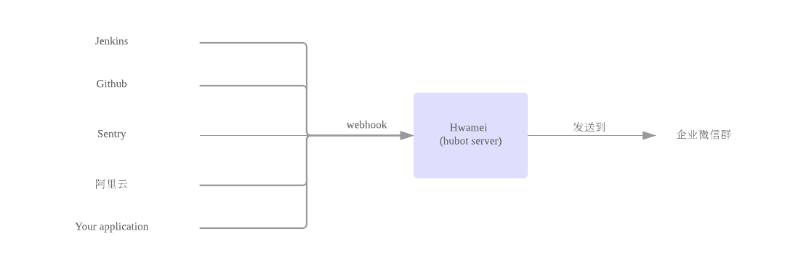

# hwamei

hwamei 是一个基于 hubot 的企业微信聊天机器人，它能够通过 webhook 将收集的信息发送到企业微信群中。

## 预览

## 工作流程

## 安装

- `git clone https://github.com/uniqueway/hwamei.git`
- 复制 sample.env 为 .env
- 将你的企业微信 corpId 和 app secret 填上
- `npm install`
- `./bin/hubot`

## 部署

见 https://github.com/hubotio/hubot/blob/master/docs/deploying.md

## 企业微信相关命令

- `hwamei>wxwork create chat {chatid} with {users}` 创建一个群, users 以英文逗号分隔
- `hwamei>wxwork destroy chat {chatid}` 删除一个群
- `hwamei>wxwork show {chatid}` 显示群信息
- `hwamei>wxwork add {userid} to {chatid}` 添加用户到指定群
- `hwamei>wxwork remove {userid} from {chatid}` 从指定群中删除用户

企业微信消息推送文档 https://work.weixin.qq.com/api/doc#90000/90135/90243

## webhook相关命令

- `hwamei>webhook create {name} from {type} to {chatid}` 创建一个 webhook
- `hwamei>webhook list` 列出所有 webhook
- `hwamei>webhook delete all` 删除所有 webhook
- `hwamei>webhook delete {token}` 删除一个 webhook
- `hwamei>webhook update {token} {name|type|chat_id} to {value}` 修改一个 webhook
- `hwamei>webhook backup` 备份 webhooks 到 ./data/webhooks.json
- `hwamei>webhook restore` 恢复 webhooks

### webhook 兼容
- incoming
  - { message: '' }
  - { text: '' }
  - { payload: { message: '' } }
  - { payload: { text: '' } }
- sentry
- gitlab
- github

## 扩展更多命令

查看 https://github.com/hubotio/hubot/blob/master/docs/scripting.md
